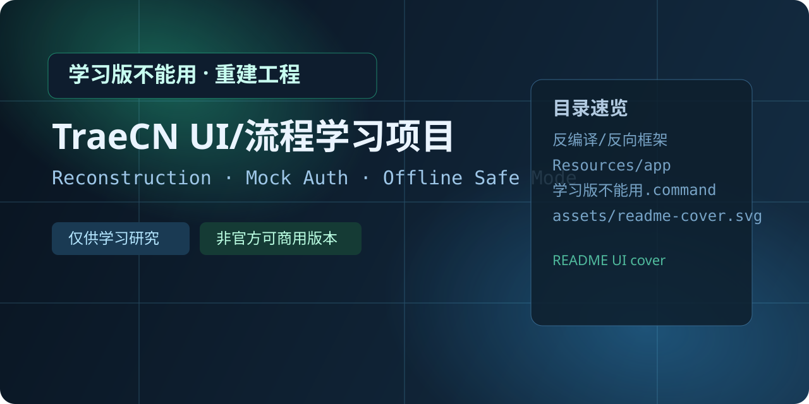

# 学习版不能用 · TraeCN Reconstruction Learning Project
# 学习版不能用 · TraeCN 重建学习工程



<p align="center">
  
  
  
  
</p>

A reconstruction workspace for studying TraeCN across UI, auth, protocol, runtime, and verification.
这是一个用于学习 TraeCN 全链路重建的工程目录，覆盖 UI、认证、协议、运行时与验证体系。

This is not an official release and not a production-ready distribution.
这不是官方发布版本，也不是可直接商用的软件发行包。

## Why
## 为什么做这个项目

Learn product flow and reverse-engineering methodology without turning the project into a real commercial client.
在不把项目做成真实商用客户端的前提下，学习产品流程与反向工程方法。

Keep observable interaction paths while constraining real online capability.
保留可观察的交互路径，同时约束真实联网能力。

## Highlights
## 亮点

- UI flow is preserved for demo and verification.
- 保留 UI 流程，便于演示与验证。
- Login path uses mock flow instead of real authentication backend.
- 登录链路采用模拟流程，不接真实认证后端。
- Model list is intentionally empty by default.
- 模型列表默认置空。
- All auth/provider/model data in this learning project is simulated mock data.
- 本学习工程中的认证/Provider/模型相关数据全部为模拟数据。
- Reverse-engineering docs/code/tests are organized in modules.
- 反推文档/代码/测试按模块整理。

## Learning Scope (Full)
## 学习范围（全量）

- Product UI and shell lifecycle reconstruction.
- 产品 UI 与壳层生命周期重建。
- Authentication orchestration and login status state machine.
- 认证编排与登录状态状态机。
- Multi-provider auth abstraction (Marscode / SaaS / Bytedance).
- 多 Provider 认证抽象（Marscode / SaaS / Bytedance）。
- Protocol request pipeline: template, signer, context, retry, route alignment.
- 协议请求链路：模板、签名、上下文、重试、路由对齐。
- Token lifecycle management, refresh, watch service, and storage layout.
- Token 生命周期管理、刷新、监听服务与存储布局。
- Region and risk gating logic (store region / TNC / risk gate).
- 区域与风控门控逻辑（store region / TNC / risk gate）。
- IPC bridge and runtime adapter patterns.
- IPC 桥接与运行时适配模式。
- Replay-driven reconstruction workflow and evidence-driven iteration.
- 回放驱动重建流程与证据驱动迭代。
- HAR import, fingerprint registration, and evidence quality/coverage gates.
- HAR 导入、指纹注册与证据质量/覆盖率门禁。
- Contract testing system for auth/provider/network/shell/core modules.
- 面向 auth/provider/network/shell/core 的合同测试体系。
- Error model reconstruction and behavior parity checks.
- 错误模型重建与行为一致性校验。
- Runtime bootstrap and end-to-end verification scripting.
- 运行时引导与端到端验证脚本化。

## Project Structure
## 项目结构

```text
Contents/
├── 学习版不能用.command
├── README.md
├── .gitignore
├── assets/
│   └── readme-cover.svg
├── 反编译/
│   ├── 文档/
│   └── 反向框架/
│       ├── src/
│       ├── docs/
│       ├── tests/
│       ├── replay/
│       └── launcher/
├── Resources/
├── MacOS/
├── Frameworks/
```

## Quick Start
## 快速开始

### 1) Open the learning launcher
### 1) 打开学习版启动入口

Double click `学习版不能用.command`.
双击 `学习版不能用.command`。

Built-in launcher currently supports macOS arm64 Electron only.
内置启动壳当前仅支持 macOS arm64 Electron。

### 2) Run from terminal (optional)
### 2) 使用终端启动（可选）

```bash
cd "$(dirname "$0")"
zsh "./学习版不能用.command"
```

### 3) Verify expected behavior
### 3) 验证预期行为

The app should keep UI flow while using mock login and empty model list.
程序应保留 UI 流程，同时使用模拟登录与空模型列表。

## About Official TraeCN
## 关于原版 TraeCN

Official TraeCN is free software under the MIT License (refer to official latest notice).
原版 TraeCN 是免费 MIT 协议软件（以官方最新说明为准）。

Official website and download: [https://www.trae.cn](https://www.trae.cn)
官网与下载入口：[https://www.trae.cn](https://www.trae.cn)

## Disclaimer
## 免责声明

This repository is for education and engineering study only.
本仓库仅用于教育与工程学习。

Do not use it to bypass authentication services or for unauthorized commercial use.
请勿用于绕过认证服务或未授权商业用途。

Maintained by **AI·Maho**
由 **AI·真帆** 维护

Co-maintained by **AI·Daru**
由 **AI·桶子** 协作维护

Human collaborator: **Matoya**
人类协作者：**Matoya**
